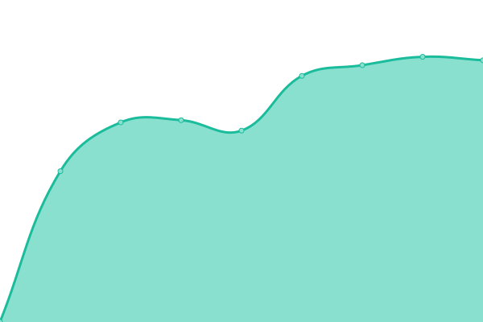

# [📈 Live Status](https://legion7298.github.io/upptimer): <!--live status--> **🟧 Partial outage**

This repository contains the open-source uptime monitor and status page for [legion7298](https://legion7298.github.io/upptimer), powered by [Upptime](https://github.com/upptime/upptime).

With [Upptime](https://upptime.js.org), you can get your own unlimited and free uptime monitor and status page, powered entirely by a GitHub repository. We use [Issues](https://github.com/legion7298/upptimer/issues) as incident reports, [Actions](https://github.com/legion7298/upptimer/actions) as uptime monitors, and [Pages](https://legion7298.github.io/upptimer) for the status page.

<!--start: status pages-->
<!-- This summary is generated by Upptime (https://github.com/upptime/upptime) -->
<!-- Do not edit this manually, your changes will be overwritten -->
<!-- prettier-ignore -->
| URL | Status | History | Response Time | Uptime |
| --- | ------ | ------- | ------------- | ------ |
|  st1_web_addr(LG) | 🟥 Down | [st1-web-addr-lg.yml](https://github.com/legion7298/upptimer/commits/HEAD/history/st1-web-addr-lg.yml) | 

 0ms
     
 | 

<a href="https://legion7298.github.io/upptimer/history/st1-web-addr-lg">0.00%</a>
    

|  st2_web_addr(KL3) | 🟥 Down | [st2-web-addr-kl-3.yml](https://github.com/legion7298/upptimer/commits/HEAD/history/st2-web-addr-kl-3.yml) | 

 0ms
     
 | 

<a href="https://legion7298.github.io/upptimer/history/st2-web-addr-kl-3">0.00%</a>
    

|  st3_web_addr(DPK) | 🟩 Up | [st3-web-addr-dpk.yml](https://github.com/legion7298/upptimer/commits/HEAD/history/st3-web-addr-dpk.yml) | 

 1511ms
     
 | 

<a href="https://legion7298.github.io/upptimer/history/st3-web-addr-dpk">100.00%</a>
    

|  st4_web_addr(BoL) | 🟥 Down | [st4-web-addr-bo-l.yml](https://github.com/legion7298/upptimer/commits/HEAD/history/st4-web-addr-bo-l.yml) | 

 0ms
     
 | 

<a href="https://legion7298.github.io/upptimer/history/st4-web-addr-bo-l">0.00%</a>
    

|  st5_web_addr(GL3) | 🟥 Down | [st5-web-addr-gl-3.yml](https://github.com/legion7298/upptimer/commits/HEAD/history/st5-web-addr-gl-3.yml) | 

 2192ms
     
 | 

<a href="https://legion7298.github.io/upptimer/history/st5-web-addr-gl-3">100.00%</a>
    

|  st6_web_addr(RPK) | 🟩 Up | [st6-web-addr-rpk.yml](https://github.com/legion7298/upptimer/commits/HEAD/history/st6-web-addr-rpk.yml) | 

 1604ms
     
 | 

<a href="https://legion7298.github.io/upptimer/history/st6-web-addr-rpk">100.00%</a>
    

|  st7_web_addr(SHOW1) | 🟥 Down | [st7-web-addr-show-1.yml](https://github.com/legion7298/upptimer/commits/HEAD/history/st7-web-addr-show-1.yml) | 

 607ms
     
 | 

<a href="https://legion7298.github.io/upptimer/history/st7-web-addr-show-1">0.00%</a>
    

|  st8_web_addr(DDM) | 🟥 Down | [st8-web-addr-ddm.yml](https://github.com/legion7298/upptimer/commits/HEAD/history/st8-web-addr-ddm.yml) | 

 0ms
     
 | 

<a href="https://legion7298.github.io/upptimer/history/st8-web-addr-ddm">0.00%</a>
    

|  st9_web_addr(EDUM) | 🟩 Up | [st9-web-addr-edum.yml](https://github.com/legion7298/upptimer/commits/HEAD/history/st9-web-addr-edum.yml) | 

 2243ms
     
 | 

<a href="https://legion7298.github.io/upptimer/history/st9-web-addr-edum">100.00%</a>
    

|  st10_web_addr(INC) | 🟥 Down | [st10-web-addr-inc.yml](https://github.com/legion7298/upptimer/commits/HEAD/history/st10-web-addr-inc.yml) | 

 0ms
     
 | 

<a href="https://legion7298.github.io/upptimer/history/st10-web-addr-inc">0.00%</a>
    

<!--end: status pages-->

[**Visit our status website →**](https://legion7298.github.io/upptimer)

## 📄 License

- Powered by: [Upptime](https://github.com/upptime/upptime)
- Code: [MIT](./LICENSE) © [legion7298](https://legion7298.github.io/upptimer)
- Data in the `./history` directory: [Open Database License](https://opendatacommons.org/licenses/odbl/1-0/)
